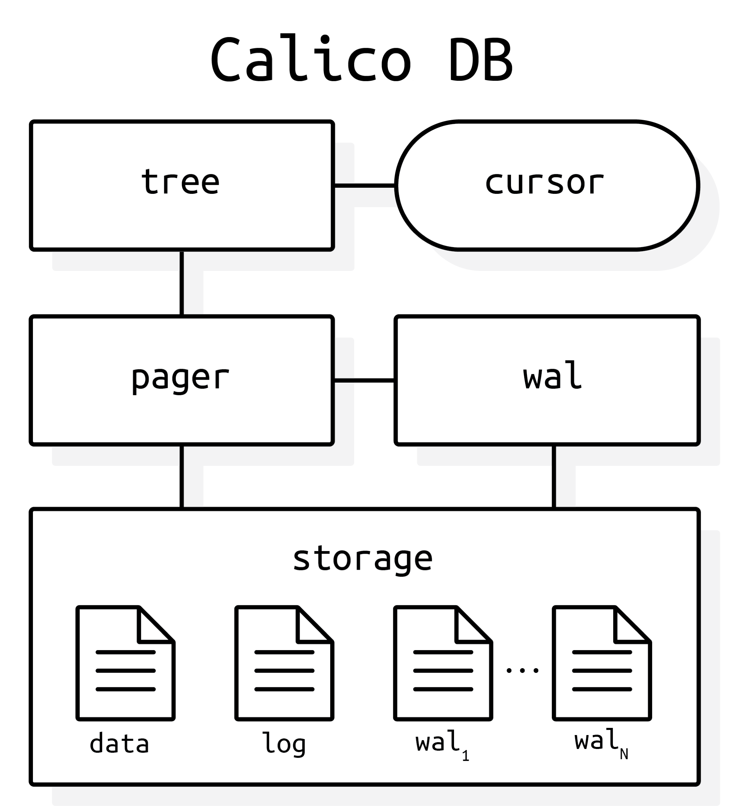

> **Warning**: This library is not quite stable and is definitely not code reviewed. 
> Use at your own risk!

> **Note**: As of 08/26, development is really coming along.
> After a bit of a redesign, Calico DB is now fast enough to be useful!
> Also, I'm back at school for my final semester, so I won't have time to add more features.
> Luckily the public API is basically finished (with the addition of the Transaction class).
> At this point, I'll be cleaning things up and working on the error handling model.
> Once I find someone to help me review all of this code, maybe we can finally put out a release!
> <p align="right"><i>Andy (<b>08/26</b>)</i></p>

Calico DB is an embedded key-value database written in C++17.
It exposes a small API that allows storage and retrieval of variable-length byte sequences.

+ [Disclaimer](#disclaimer)
+ [Features](#features)
+ [Caveats](#caveats)
+ [Dependencies](#dependencies)
+ [Build](#build)
+ [API](#api)
+ [Performance](#performance)
+ [Design](#design)
+ [TODO](#todo)
+ [Source Tree](#source-tree)
+ [Contributions](#contributions)

## Features
+ Durability provided through write-ahead logging
+ Uses a dynamic-order B<sup>+</sup>-tree to organize the data on disk
+ Supports forward and reverse traversal using cursors
+ Supports variable-length keys and values (with a hard limit on both)
+ API only exposes objects (no pointers to deal with)
+ Allows tuning of various parameters (page size, cache size, etc.)
+ Transactions provided as first-class objects

## Caveats
+ Currently, Calico DB only runs on 64-bit Ubuntu and OSX
+ Has a hard limit on key length (anywhere from 29 B to ~16 KB, depending on the page size)
+ Has a hard limit on value length, equal to roughly 4 GB
+ Only one transaction may be running at any given time
+ Doesn't provide synchronization past support for concurrent cursors

## Dependencies
The library itself depends on `@gabime/spdlog` and `@TartanLlama/expected`.
`spdlog` is downloaded during the build using CMake's FetchContent API, and `expected` is bundled with the source code.
The tests depend on `@google/googletest`.

## Build
Calico DB is built using CMake.
In the project root directory, run
```bash
mkdir -p build && cd ./build
```

followed by
```bash
cmake -DCMAKE_BUILD_TYPE=RelWithAssertions .. && cmake --build .
```

to build the library and tests.
Note that the tests must be built with assertions, hence the `RelWithAssertions`.
To build the library in release mode without tests, the last command would look like:
```bash
cmake -DCMAKE_BUILD_TYPE=Release -DCALICO_BUILD_TESTS=Off .. && cmake --build .
```

## API
See the [API documentation](doc/api.md).

## Architecture

<p align="center">
   
</p>

## Performance
Benchmarks are run in a modified version of LevelDB, using the `db_bench` routines.
Below are the results of running some of `db_bench` on Calico DB and SQLite3.

```
Calico DB:  version 0.0.1
SQLite:     version 3.37.2
CPU:        16 * 12th Gen Intel(R) Core(TM) i5-12600K
CPUCache:   20480 KB
```

### Calico DB
The `fillseq`, `fillrandom`, and `overwrite` benchmarks were run using a transaction size of 1000.
Performing many modifications outside a transaction is slow, since each operation is guaranteed to be atomic.

| Benchmark                | Result (ops/second) |
|:-------------------------|--------------------:|
| fillseq                  |             311,526 |
| fillrandom               |             139,801 |
| overwrite                |             124,038 |
| readrandom               |           1,524,390 |
| readseq                  |           5,524,861 |
| fillrand100K<sup>1</sup> |                 460 |
| fillseq100K<sup>1</sup>  |                 450 |

<sup>1</sup> These need some work!

### SQLite3
| Benchmark    | Result (ops/second) |
|:-------------|--------------------:|
| fillseq      |             352,361 |
| fillrandom   |             186,567 |
| overwrite    |             185,529 |
| readrandom   |             497,265 |
| readseq      |           7,936,508 |
| fillrand100K |               5,185 |
| fillseq100K  |               7,572 |

## TODO
1. Get everything code reviewed!
2. Get unit test coverage up
3. Write documentation
4. Work on performance
5. Get the CMake installation to work
6. Need some way to reduce the file size once many pages become unused
    + We need some way to collect freelist pages at the end of the file so that we can truncate

## Design
Internally, Calico DB is broken down into 6 submodules.
Each submodule is represented by a directory in `src`, as shown in the [source tree](#source-tree).
Check out the [documentation](./doc) for more information about the design of Calico DB.

## Source Tree
```
CalicoDB
┣╸examples ┄┄┄┄┄┄┄┄┄ Examples and use cases
┣╸include/calico
┃ ┣╸bytes.h ┄┄┄┄┄┄┄┄ Constructs for holding contiguous sequences of bytes
┃ ┣╸calico.h ┄┄┄┄┄┄┄ Pulls in the rest of the API
┃ ┣╸common.h ┄┄┄┄┄┄┄ Common types and constants
┃ ┣╸cursor.h ┄┄┄┄┄┄┄ Cursor for database traversal
┃ ┣╸database.h ┄┄┄┄┄ Toplevel database object
┃ ┣╸info.h ┄┄┄┄┄┄┄┄┄ Query information about the database
┃ ┣╸options.h ┄┄┄┄┄┄ Options for the toplevel database object
┃ ┣╸status.h ┄┄┄┄┄┄┄ Status object for function returns
┃ ┣╸store.h ┄┄┄┄┄┄┄┄ Storage interface
┃ ┗╸transaction.h ┄┄ First-class transaction object
┣╸src
┃ ┣╸core ┄┄┄┄┄┄┄┄┄┄┄ API implementation
┃ ┣╸pager ┄┄┄┄┄┄┄┄┄┄ Pager module
┃ ┣╸store ┄┄┄┄┄┄┄┄┄┄ Storage implementations
┃ ┣╸tree ┄┄┄┄┄┄┄┄┄┄┄ Data organization module
┃ ┣╸utils ┄┄┄┄┄┄┄┄┄┄ Utility module
┃ ┗╸wal ┄┄┄┄┄┄┄┄┄┄┄┄ Write-ahead log implementations
┗╸test
  ┣╸fuzz ┄┄┄┄┄┄┄┄┄┄┄ Fuzz tests
  ┣╸recovery ┄┄┄┄┄┄┄ Test database failure and recovery
  ┣╸tools ┄┄┄┄┄┄┄┄┄┄ Test tools
  ┗╸unit_tests ┄┄┄┄┄ Unit tests
```

## Contributions
Contributions are welcome!
The [TODO](#todo) section contains a list of things that need to be addressed.
Also, pull requests that fix bugs or address correctness issues will always be considered.
Feel free to create a pull request.


